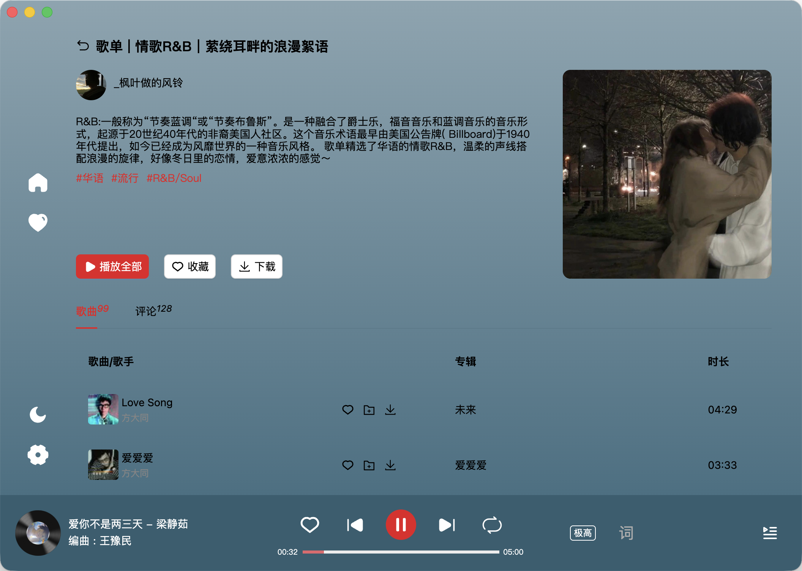
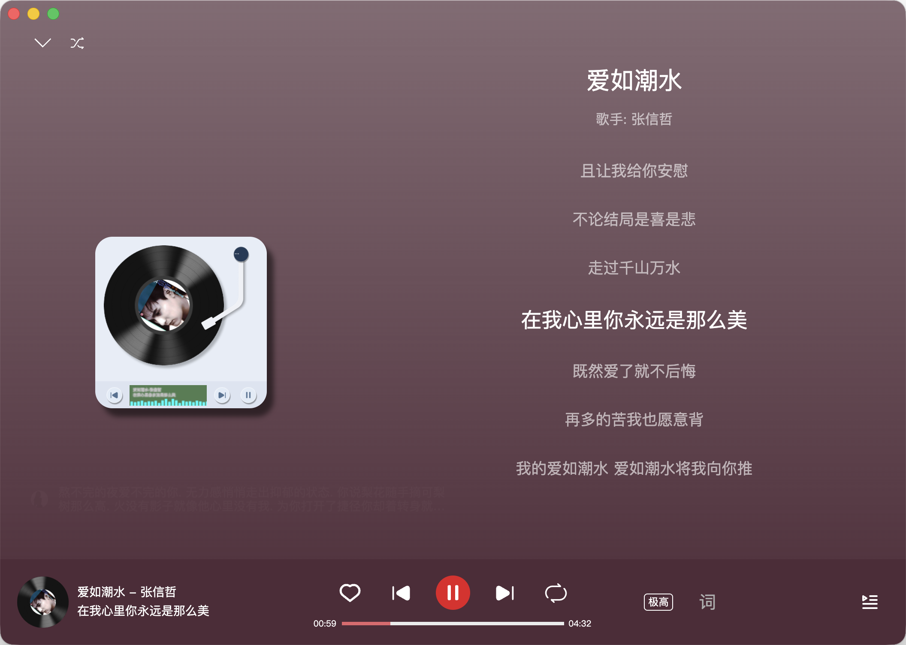

# x-music

一个完全免费的音乐播放器，数据源来自网络，使用Electron、Vue、TypeScript构建，支持windows、macOS和Linux平台，实现听歌自由。

内容数据来自 [NeteaseCloudMusicApi](https://github.com/Binaryify/NeteaseCloudMusicApi)  
音频数据来自 [GD音乐台](https://music.gdstudio.org)

## 软件功能

✅ 跨平台，windows/macOS/Linux  
✅ 内容推荐  
✅ 歌曲、歌单、歌手搜索  
✅ 歌单、歌手、排行榜、评论查看  
✅ 支持高品音质切换  
✅ 支持MV播放  
✅ 支持白天/黑夜模式  
✅ 支持高品歌曲下载  
✅ 沉浸式播放界面  
✅ 桌面歌词  
✅ 账号登录  
🚫 本地音乐

## 运行截图


  


## 开发

## 推荐IDE配置

- [VSCode](https://code.visualstudio.com/) + [ESLint](https://marketplace.visualstudio.com/items?itemName=dbaeumer.vscode-eslint) + [Prettier](https://marketplace.visualstudio.com/items?itemName=esbenp.prettier-vscode) + [Volar](https://marketplace.visualstudio.com/items?itemName=Vue.volar)

### 安装依赖

```bash
$ npm install
```

### 开发启动

```bash
$ npm run dev
```

### 构建

```bash
# For windows
$ npm run build:win

# For macOS
$ npm run build:mac

# For Linux
$ npm run build:linux
```

## 运行错误

1. 如果运行时提醒文件`“X Music”已损坏，无法打开。 你应该将它移到废纸篓`  
   在终端中运行`sudo xattr -dr com.apple.quarantine /Applications/X\ Music.app`
2. 无法验证签名，在系统设置安全和隐私中点击允许打开

## 打赏

如果您觉得本软件对您有用，您可以通过以下方式打赏作者，您的支持是作者最大的动力！

<table>
   <tbody>
      <tr>
         <td align="center">
            
            <br>微信
         </td>
         <td align="center">
            
            <br>支付宝
         </td>
      </tr>
   </tbody>
</table>

# 特别申明

1. 本程序仅用于个人学习，禁止用于商业用途，否则后果自负！
2. 尊重版权，支持正版！
